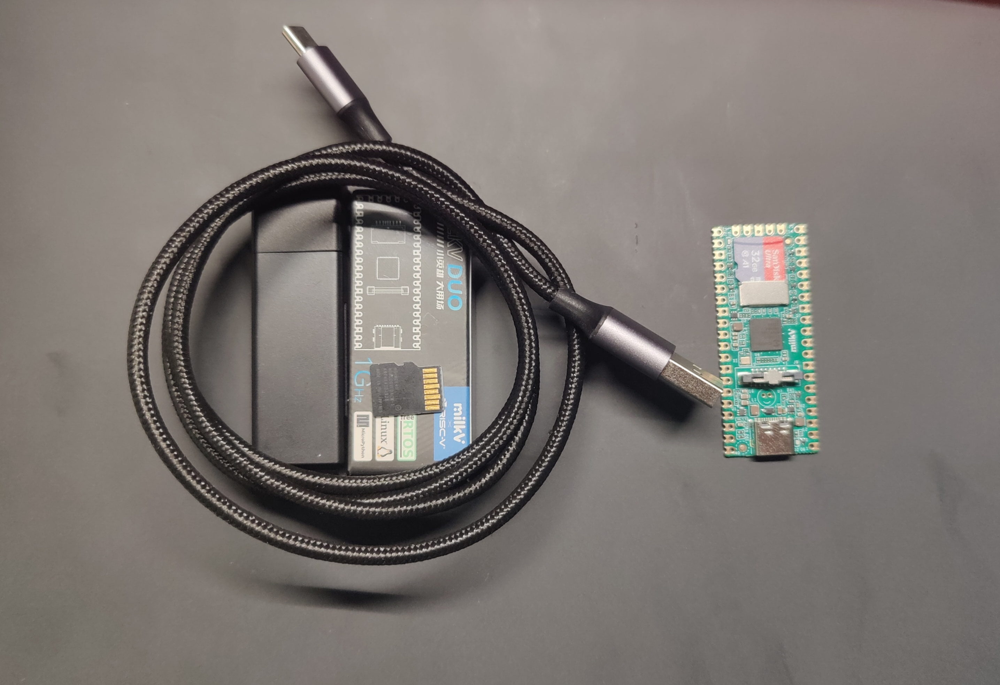
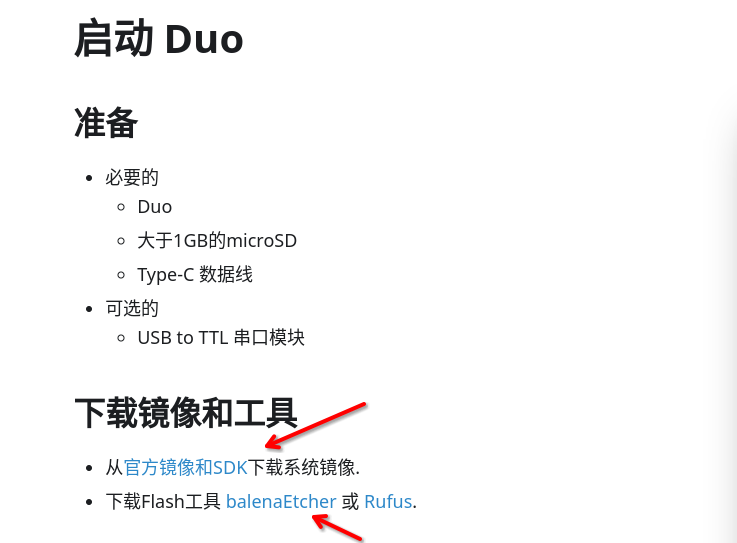
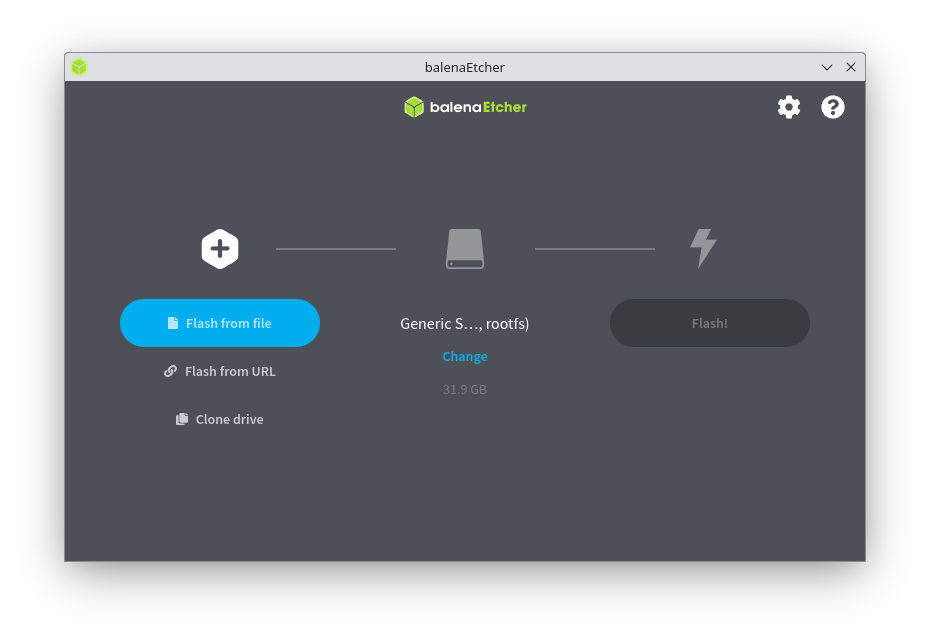
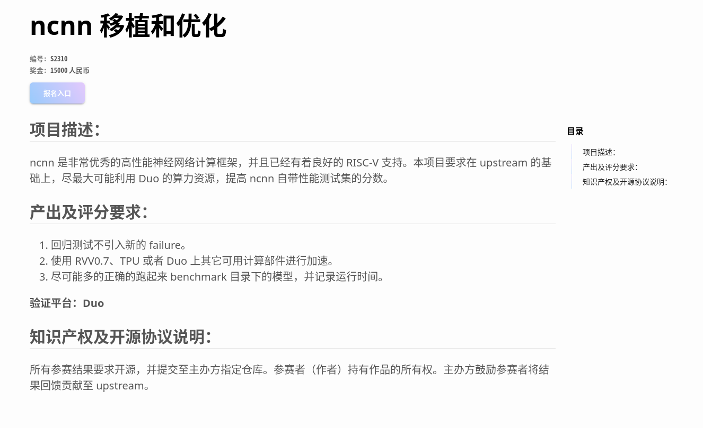
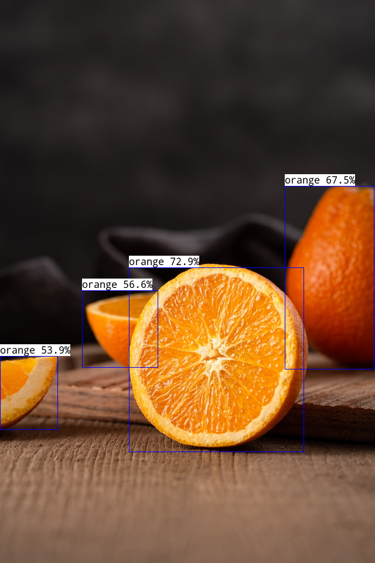

# S2310: ncnn 移植和优化快速上手


## 本文的背景和致谢

本文是 [S2310 赛题讲解直播回放](https://www.bilibili.com/video/BV1Ce411b7PT) 的文字版。
如果更偏好视频类型，可以访问此链接。

本文将尝试图文并茂地展示以下内容:

- 点亮 Milk-V Duo
- 编译可以在 Milk-V Duo 上运行的 ncnn
- 在 Milk-V Duo 上运行 ncnn 的基准测试

首先感谢北京算能科技有限公司对本次比赛的赞助。
以下是本次赛事信息: 

- 官网: https://rvspoc.org/
- FAQ 页面: https://rvspoc.org/faq/
- 电子邮件：rvspoc@cyberlimes.cn

本文撰写和本次直播稿件的准备过程中，参考了以下材料，感谢 nihui 大佬和一众其他伙伴对 RISC-V 生态的贡献:

1. [Milk-V Duo 官方文档](https://milkv.io/zh/docs/duo/getting-started/setup)
2. [nihui: 在全志d1开发板上玩ncnn](https://zhuanlan.zhihu.com/p/386312071)
3. [RISC-V SoC + AI | 在全志 D1「哪吒」开发板上，跑个 ncnn 神经网络推理框架的 demo](https://verimake.com/d/35-risc-v-soc-ai-d1-ncnn-demo)

## 点亮 Duo

### 云开箱

图中是本次演示中除了电脑外所需要使用到的所有硬件物品，下文会做更详细的介绍。



### 必要的准备

本次演示过程使用的有关软硬件，仅作参考:

- 本机: Debian Sid，也可以是其他 Windows, MacOS 或者 GNU/Linux 系统的可联网电脑
- 目标机器: Milk-V Duo
- SD 卡: 32G
- 读卡器
- USB A to C 数据线 供电和 RNDIS

- **可选:** USB 转 TTL

### 烧写镜像

准备好上文的所有工具后，我们还需要镜像烧写工具和下载镜像。

根据 [Milk-V Duo 官方文档链接:](https://milkv.io/zh/docs/duo/getting-started/boot):



烧写镜像先需要镜像，并准备 [Rufus](https://rufus.ie/) 或者 [balenaEtcher](https://etcher.balena.io/), 
这两个软件人机界面友好，属于居家旅行，烧写镜像常用利器。


准备好烧写软件后从 [下载链接:](https://milkv.io/docs/duo/resources/image-sdk) 下载 Duo 镜像。


跳转页面后在下拉页面找到下图中文件，点击下载后进行解压。


准备好后拿出读卡器和 SD 卡，然后将 SD 卡和读卡器合体后插入到 PC 上。
启动 balenaEtcher（或者 Rufus）,选择 Flash from file，选择解压后的镜像。



之后在 select target 按钮弹出菜单在中选中读卡器设备。


一切就绪后选择 Flash 按钮即可开始烧写。


到这里烧写镜像环节大功告成。


### 上电

将烧写后的 SD 卡插入 Duo 中，由于 Duo 官方镜像支持 RNDIS，这意味着我们可以通过 USB 以网络的方式访问 Duo。
通过数据线连接电脑，在运行 Debian 的 KDE Plasma 桌面下会弹出这样的提示:


这通常意味着本机已经成功连接上了 Duo 的网络。

之后我们通过 `ssh root@192.168.42.1` 便可以访问并打印一个 hello。


### 在 Duo 上编译和运行第一个程序

在前面的步骤里我们已经成功点亮了 Duo, 并通过网络连接了 Duo, 在板子上打印出了 hello 信息。
这里将引入 Duo 官方的工具链 duo-examples ，其包含一些运行在 Duo 上的 c/c++ 例程。
我们可以在这里使用它熟悉对 Duo 的交叉编译开发，也可以为下文在 Duo 上编译 ncnn 做铺垫:

首先在工作机上配置 Duo 的工具链

```BASH=
sudo apt-get install wget git make
git clone https://github.com/milkv-duo/duo-examples.git

cd duo-examples
source envsetup.sh
```

在工作机上编译 Hello world 并上传到 Duo，Duo 的 IP 是 192.168.42.1, 密码是 `milkv`

```BASH=
cd hello-world
make

scp -O helloworld root@192.168.42.1:/root/

[root@milkv]~# ./helloworld
Hello, World!
```

### 总结

本环节大家已经认识了一位新朋友 Milk-V Duo。
并能通过网络访问它，并在上面运行自己编译好的程序。


## ncnn 和 Milk-V Duo


### 题目介绍



由官网的题目介绍我们可以得知:

- ncnn 已经有了较好的 RISC-V 架构支持。
- 本次比赛使用 ncnn 自带测试集评分。

那么下文也将围绕这两点来演示，最终目的是达到在 Duo 上启动 ncnn 的自带测试集 benchncnn。


### 使用 duo-sdk 编译 ncnn

#### 在 duo-examples 目录下载 ncnn 源码

使用前一个章节中编译 HelloWorld 例程的工具链编译 ncnn。
由于 ncnn 对 RISC-V 的架构支持是主干上的，这里直接使用 ncnn 最新的代码即可。

```BASH=
cd duo-examples/
git clone https://github.com/Tencent/ncnn.git
```

#### 配置环境变量

Milk-V Duo 的官方镜像使用了 musl libc 库，因此我们编译 ncnn 的时候也要使用相同的 libc 库。

```BASH=
export RISCV_ROOT_PATH=$(pwd)/duo-sdk/riscv64-linux-musl-x86_64/

```

#### 工具链修改

ncnn 源码目录中包含了一系列的 cmake toolchain 文件，其中 c906-v240 是 ncnn 官方当前使用在 CI 上的版本。
这个版本对我们来说的唯一问题只是它的 libc 不是 musl。做出以下小修改后就可以使用 Duo 的工具链来构建 ncnn。

```BASH=
# 复制一份 ncnn/toolchains 目录中 的 c906-v240.toolchain.cmake
cp ncnn/toolchains/c906-v240.toolchain.cmake ncnn/toolchains/c906-v240-musl.toolchain.cmake
# 然后进行以下修改:
set(CMAKE_C_COMPILER "${RISCV_ROOT_PATH}/bin/riscv64-unknown-linux-musl-gcc")
set(CMAKE_CXX_COMPILER "${RISCV_ROOT_PATH}/bin/riscv64-unknown-linux-musl-g++")
```

在工作机器上进行编译:

```BASH=
# ncnn 需要 cmake 进行编译配置
sudo apt install cmake -y
cd ncnn
mkdir -p build-duo
cd build-duo
cmake -DCMAKE_TOOLCHAIN_FILE=../toolchains/c906-v240-musl.toolchain.cmake \
    -DCMAKE_BUILD_TYPE=release -DNCNN_OPENMP=OFF -DNCNN_THREADS=OFF -DNCNN_RUNTIME_CPU=OFF -DNCNN_RVV=ON \
    -DNCNN_SIMPLEOCV=ON -DNCNN_BUILD_EXAMPLES=ON ..
cmake --build . -j 4
# 这里的线程数按照当前系统的实际大小来配置。
```

### 在 Duo 上运行 ncnn 的 benchmark

#### 准备测试的工具集

成功编译后，我们可以在 build-duo 文件夹下看到一个 benchmark 文件夹，还需要将 ncnn 源码路径
下的 .param 文件复制到 benchmark 文件夹下。之后将整个文件夹放到 Duo 上。

```BASH=
# 以下步骤在 build-duo 文件夹下执行
cp ../benchmark/*.param benchmark/
scp -O -r benchmark root@192.168.42.1:
```

#### 使用 swap

直接运行 ./benchncnn 的时候你可能发现了程序被 Killed 掉。这是因为触发了 OOM。

```BASH=
[root@milkv-duo]~/benchmark# ./benchncnn 4 1 0 -1 0
syscall error -1
loop_count = 4
num_threads = 1
powersave = 0
gpu_device = -1
cooling_down = 0
Killed
```

这里演示通过 swap 的方式来使得它继续运行下去。

官方镜像默认存在一个 256M 大小的空分区，位于 /dev/mmcblk0p3。我们可以在 Duo 上用它来充当 
swap。

```BASH=
ssh root@192.168.42.1 
# 以下步骤在 Duo 本体进行
mkswap /dev/mmcblk0p3 
swapon /dev/mmcblk0p3
```

#### 运行 benchncnn

这里我们通过 ctrl + c 的方式提前结束了测试，因为在 Duo 上这个测试的时间并不短。如果你有兴趣查阅完整的日志，
见本文最后。

./benchncnn 

```BASH=
[root@milkv-duo]~/benchmark# ./benchncnn 4 1 0 -1 0
syscall error -1
loop_count = 4
num_threads = 1
powersave = 0
gpu_device = -1
cooling_down = 0
          squeezenet  min =  273.92  max =  277.25  avg =  275.67
^C
```


### example: 使用 NanoDet 识别一张图片

```BASH=
# 此部分操作在 ncnn 源码目录下执行
git clone https://github.com/nihui/ncnn-assets.git
mkdir nanodet-test
cp ncnn-assets/models/nanodet_m.bin nanodet-test/
cp ncnn-assets/models/nanodet_m.param nanodet-test/
cp build-duo/examples/nanodet nanodet-test/
wget "https://unsplash.com/photos/5x4QVpWrz6Q/download?ixid=M3wxMjA3fDB8MXxhbGx8fHx8fHx8fHwxNzAyNzg4MTUyfA&force=true&w=640" -O test_dog.jpg
# 此处选择了图片的最小尺寸
scp -O -r nanodet-test/ root@192.168.42.1:
ssh root@192.168.42.1
```

以下内容在 Duo 上运行:

```BASH=
[root@milkv-duo]~# ./nanodet test.jpg 
21 = 0.67969 at 405.90 662.90 2767.51 x 1294.85
imshow save image to image.png
waitKey stub
```

图片需要从 Duo 上下载到工作机上查看

```BASH=
scp -O root@192.168.42.1:~/nanodet-test/image.png .
```


Photo by [Donnie Rosie](https://unsplash.com/@drosie?utm_content=creditCopyText&utm_medium=referral&utm_source=unsplash) on [Unsplash](https://unsplash.com/photos/a-dog-and-a-cat-laying-in-the-grass-ouo1hbizWwo?utm_content=creditCopyText&utm_medium=referral&utm_source=unsplash)



Photo by [Mae Mu](https://unsplash.com/@picoftasty?utm_content=creditCopyText&utm_medium=referral&utm_source=unsplash)  on [Unsplash](https://unsplash.com/photos/sliced-orange-fruit-on-brown-wooden-table-9002s2VnOAY?utm_content=creditCopyText&utm_medium=referral&utm_source=unsplash)
  


### 进阶使用:

#### 使用 build-duo-sdk 项目制作一个使用更大内存和根分区的镜像

duo-buildroot-sdk 是构建 Duo 镜像的一个项目。我们通过这个项目可以来制作一个拥有更大内存和根分区的 Duo 镜像。

```BASH=
git clone https://github.com/milkv-duo/duo-buildroot-sdk.git --depth=1
cd duo-buildroot-sdk/
docker run -itd --name duodocker -v $(pwd):/home/work ubuntu:22.04 /bin/bash

docker exec -it duodocker /bin/bash
# 以下步骤在容器中执行
apt update && apt install -y pkg-config build-essential ninja-build automake autoconf libtool wget curl git gcc libssl-dev bc \
slib squashfs-tools android-sdk-libsparse-utils jq python3-distutils scons parallel tree python3-dev python3-pip device-tree-compiler \
ssh cpio fakeroot libncurses5 flex bison libncurses5-dev genext2fs rsync unzip dosfstools mtools tcl openssh-client cmake

cd /home/work/ 

# 稍微做一些修改
```

通过减少 FreeRTOS 的内存占用，来增大 Duo linux 部分的内存

```BASH=
diff --git a/build/boards/cv180x/cv1800b_milkv_duo_sd/memmap.py b/build/boards/cv180x/cv1800b_milkv_duo_sd/memmap.py
index 84161267a..99d640134 100644
--- a/build/boards/cv180x/cv1800b_milkv_duo_sd/memmap.py
+++ b/build/boards/cv180x/cv1800b_milkv_duo_sd/memmap.py
@@ -40,7 +40,7 @@ class MemoryMap:
     # =================
     # Multimedia buffer. Used by u-boot/kernel/FreeRTOS
     # =================
-    ION_SIZE = 26.80078125 * SIZE_1M
+    ION_SIZE = 0 * SIZE_1M
     H26X_BITSTREAM_SIZE = 0 * SIZE_1M
     H26X_ENC_BUFF_SIZE = 0
     ISP_MEM_BASE_SIZE = 0 * SIZE_1M
diff --git a/milkv/genimage-milkv-duo.cfg b/milkv/genimage-milkv-duo.cfh:500g
index 71938363b..4f7114d6c 100644
--- a/milkv/genimage-milkv-duo.cfg
+++ b/milkv/genimage-milkv-duo.cfg
@@ -13,7 +13,7 @@ image rootfs.ext4 {
        ext4 {
                label = "rootfs"
        }
-       size = 768M
+       size = 2G
 }
```

添加上述补丁后进行编译:
```
./build_milkv.sh
```


### 总结

在本环节，我们做了以下几件事:

- 为 Duo 编译 ncnn
- 在 Duo 上运行 benchncnn
- 在 Duo 上使用 NanoDet 识别一张图片
- 扩大 Duo 的内存和根分区大小

## 一些参考的 benchmark 结果


扩容内存到 55M 后的官方镜像 (不带 Swap):

```BASH=
[root@milkv-duo]~/benchmark# ./benchncnn 4 1 0 -1 0
syscall error -1
loop_count = 4
num_threads = 1
powersave = 0
gpu_device = -1
cooling_down = 0
          squeezenet  min =  273.92  max =  277.25  avg =  275.67
     squeezenet_int8  min = 9942.14  max = 9948.15  avg = 9945.36
           mobilenet  min =  410.33  max =  415.27  avg =  413.27
      mobilenet_int8  min = 15351.31  max = 15387.41  avg = 15371.06
        mobilenet_v2  min =  314.81  max =  318.77  avg =  317.34
        mobilenet_v3  min =  255.65  max =  256.01  avg =  255.81
          shufflenet  min =  466.50  max =  468.64  avg =  467.43
       shufflenet_v2  min =  295.90  max =  298.52  avg =  297.32
             mnasnet  min =  313.73  max =  316.84  avg =  315.20
     proxylessnasnet  min =  365.30  max =  369.27  avg =  367.65
     efficientnet_b0  min =  437.35  max =  440.78  avg =  439.53
   efficientnetv2_b0  min =  619.91  max =  620.63  avg =  620.34
        regnety_400m  min =  446.89  max =  447.13  avg =  447.04
           blazeface  min =  151.67  max =  154.00  avg =  152.37
Killed

```

扩容内存到 55M 后的官方镜像 (带 256M swap):

```BASH=
[root@milkv-duo]~/benchmark# ./benchncnn 4 1 0 -1 0
syscall error -1
loop_count = 4
num_threads = 1
powersave = 0
gpu_device = -1
cooling_down = 0
          squeezenet  min =  274.02  max =  277.77  avg =  275.74
     squeezenet_int8  min = 9983.07  max = 9989.31  avg = 9985.84
           mobilenet  min =  411.87  max =  416.03  avg =  414.19
      mobilenet_int8  min = 15315.66  max = 15331.87  avg = 15324.62
        mobilenet_v2  min =  314.58  max =  317.50  avg =  316.46
        mobilenet_v3  min =  254.89  max =  257.84  avg =  256.19
          shufflenet  min =  464.68  max =  468.03  avg =  466.54
       shufflenet_v2  min =  297.29  max =  298.75  avg =  298.12
             mnasnet  min =  314.28  max =  316.66  avg =  315.87
     proxylessnasnet  min =  366.75  max =  369.33  avg =  367.72
     efficientnet_b0  min =  440.04  max =  440.77  avg =  440.27
   efficientnetv2_b0  min =  619.73  max =  622.84  avg =  620.73
        regnety_400m  min =  444.73  max =  447.58  avg =  446.45
           blazeface  min =  151.66  max =  154.23  avg =  152.43
           googlenet  min = 4987.18  max = 5354.21  avg = 5202.79
      googlenet_int8  min = 22488.44  max = 22500.56  avg = 22492.13
            resnet18  min = 7455.04  max = 7646.00  avg = 7583.98
       resnet18_int8  min = 22949.19  max = 23009.44  avg = 22981.76
             alexnet  min = 14737.27  max = 17431.55  avg = 15534.56
layer load_model 19 fc6 failed
Segmentation fault

```

扩容内存到 55M 后的官方镜像 (带 2G swap):

```BASH=
[root@milkv-duo]~/benchmark# ./benchncnn 4 1 0 -1 0
syscall error -1
loop_count = 4
num_threads = 1
powersave = 0
gpu_device = -1
cooling_down = 0
          squeezenet  min =  274.88  max =  276.58  avg =  275.71
     squeezenet_int8  min = 9980.61  max = 9987.91  avg = 9983.44
           mobilenet  min =  411.36  max =  414.96  avg =  413.31
      mobilenet_int8  min = 15355.98  max = 15389.13  avg = 15372.54
        mobilenet_v2  min =  315.22  max =  317.19  avg =  316.66
        mobilenet_v3  min =  254.42  max =  257.17  avg =  255.69
          shufflenet  min =  467.07  max =  467.95  avg =  467.45
       shufflenet_v2  min =  295.50  max =  299.07  avg =  297.34
             mnasnet  min =  314.52  max =  317.05  avg =  315.91
     proxylessnasnet  min =  366.04  max =  368.48  avg =  367.60
     efficientnet_b0  min =  437.37  max =  440.51  avg =  439.46
   efficientnetv2_b0  min =  619.37  max =  620.65  avg =  620.18
        regnety_400m  min =  447.24  max =  449.94  avg =  448.01
           blazeface  min =  151.61  max =  154.29  avg =  152.42
           googlenet  min = 5000.10  max = 5636.20  avg = 5261.11
      googlenet_int8  min = 22437.68  max = 22444.97  avg = 22441.68
            resnet18  min = 7330.68  max = 7675.20  avg = 7477.65
       resnet18_int8  min = 22966.58  max = 23021.13  avg = 22998.51
             alexnet  min = 11938.44  max = 12196.90  avg = 12094.01
               vgg16  min = 44000.38  max = 47009.99  avg = 44839.32
          vgg16_int8  min = 293365.66  max = 295172.74  avg = 294164.78
            resnet50  min = 13413.82  max = 15019.81  avg = 14097.83
       resnet50_int8  min = 100884.12  max = 101122.62  avg = 100962.62
      squeezenet_ssd  min = 6724.08  max = 7115.88  avg = 6900.39
 squeezenet_ssd_int8  min = 39399.45  max = 40135.92  avg = 39790.72
       mobilenet_ssd  min =  920.82  max =  932.20  avg =  923.92
  mobilenet_ssd_int8  min = 49123.58  max = 49951.37  avg = 49524.87
      mobilenet_yolo  min = 4908.87  max = 5503.58  avg = 5186.98
  mobilenetv2_yolov3  min = 1090.46  max = 1094.07  avg = 1092.62
         yolov4-tiny  min = 6768.60  max = 6927.96  avg = 6830.11
           nanodet_m  min =  685.60  max =  689.89  avg =  687.48
    yolo-fastest-1.1  min =  389.98  max =  394.02  avg =  392.18
      yolo-fastestv2  min =  235.22  max =  238.54  avg =  237.48
  vision_transformer  min = 70775.45  max = 72182.53  avg = 71350.73
          FastestDet  min =  243.84  max =  247.89  avg =  245.43
```

第三方 Archlinux 带 55 MB 内存的 Archlinux 镜像 (不带 swap）：
 
 ```BASH=
[root@milkv-duo]~/benchmark# ./benchncnn 4 1 0 -1 0
syscall error -1
loop_count = 4
num_threads = 1
powersave = 0
gpu_device = -1
cooling_down = 0
          squeezenet  min =  274.02  max =  277.77  avg =  275.74
     squeezenet_int8  min = 9983.07  max = 9989.31  avg = 9985.84
           mobilenet  min =  411.87  max =  416.03  avg =  414.19
      mobilenet_int8  min = 15315.66  max = 15331.87  avg = 15324.62
        mobilenet_v2  min =  314.58  max =  317.50  avg =  316.46
        mobilenet_v3  min =  254.89  max =  257.84  avg =  256.19
          shufflenet  min =  464.68  max =  468.03  avg =  466.54
       shufflenet_v2  min =  297.29  max =  298.75  avg =  298.12
             mnasnet  min =  314.28  max =  316.66  avg =  315.87
     proxylessnasnet  min =  366.75  max =  369.33  avg =  367.72
     efficientnet_b0  min =  440.04  max =  440.77  avg =  440.27
   efficientnetv2_b0  min =  619.73  max =  622.84  avg =  620.73
        regnety_400m  min =  444.73  max =  447.58  avg =  446.45
           blazeface  min =  151.66  max =  154.23  avg =  152.43
           googlenet  min = 4987.18  max = 5354.21  avg = 5202.79
      googlenet_int8  min = 22488.44  max = 22500.56  avg = 22492.13
            resnet18  min = 7455.04  max = 7646.00  avg = 7583.98
       resnet18_int8  min = 22949.19  max = 23009.44  avg = 22981.76
             alexnet  min = 14737.27  max = 17431.55  avg = 15534.56
layer load_model 19 fc6 failed
Segmentation fault

```

所有 55M 内存无法运行的项目
```bash
alexnet.param              resnet18.param             squeezenet_ssd.param       vgg16_int8.param
googlenet.param            resnet50.param             squeezenet_ssd_int8.param  vision_transformer.param
mobilenet_yolo.param       resnet50_int8.param        vgg16.param
yolov4-tiny.param
```

55M 可以运行的项目
```bash
FastestDet.param          mobilenet.param           mobilenetv2_yolov3.param  shufflenet_v2.param
blazeface.param           mobilenet_int8.param      nanodet_m.param           squeezenet.param
efficientnet_b0.param     mobilenet_ssd.param       proxylessnasnet.param     squeezenet_int8.param
efficientnetv2_b0.param   mobilenet_ssd_int8.param  regnety_400m.param
yolo-fastest-1.1.param
googlenet_int8.param      mobilenet_v2.param        resnet18_int8.param
yolo-fastestv2.param
mnasnet.param             mobilenet_v3.param        shufflenet.param
```


 
